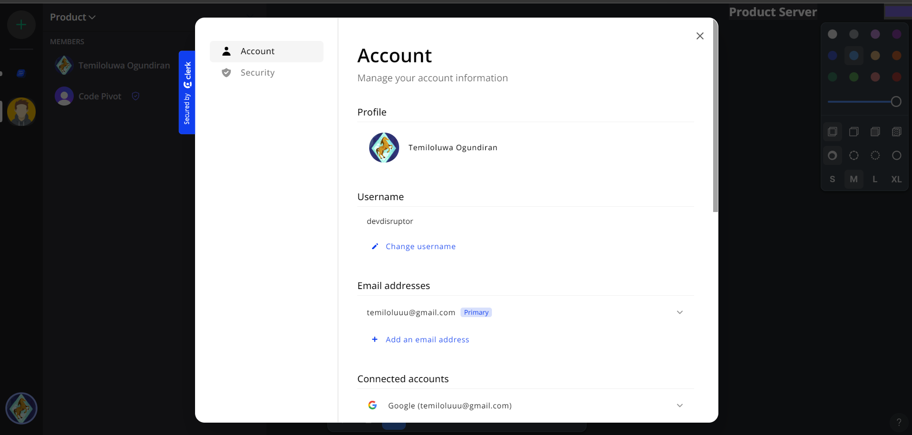
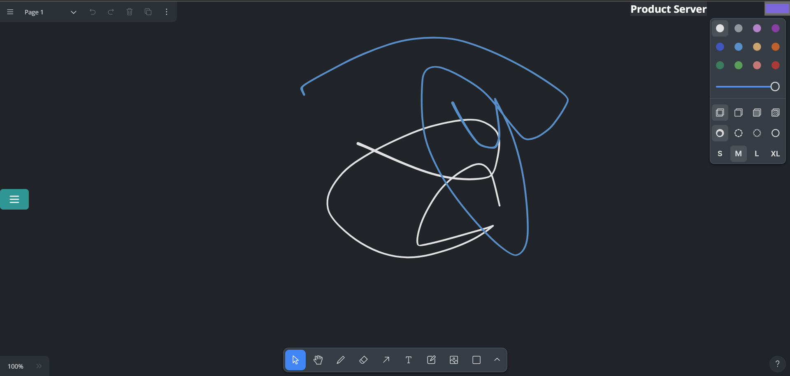

Team Talker

A Collaborative Whiteboarding tool

Demo link not available now, used to hosted on heroku

<p align="center">  
  
</p>

## Features and Interfaces

1. Login Page

<p align="center">  
  
</p>

2. Home page
   <p align="center">  
   
   </p>

   - Displays Canvas
   - Displays Servers
   - Dislays Memebers of Server

3. Invite Modal

   - Generate Invite link
   - Copy Invite Link to share to others
   - 

4. Manage Mebers Modal

   - Change Memebers role for GUEST To MODERATOR or vice versa by Admin
   - Kick memebers out of Server

   - 

5. User Profile

   - View and Edit User Profile
   - Change Password, View active devices

   - 

6. Canvas

   - 

## Tech stack

#### Frontend

- Shadcnui
- Chakra ui
- Nextjs
- Typescript

#### Backend

- yjs-websocket
- Postgresql
- Prisma

#### Other libraries

- Clerk for authentication
- uploadthing for storing files
- tldraw for canvas

## Getting Started

#### To run the local development server, first clone this repo.

```html
git clone https://github.com/Temiloluwa-Ogundiran/teamtalker.git
```

#### Install dependencies

```html
npm install
```

#### Setup Environment Variables

```html
NEXT_PUBLIC_CLERK_PUBLISHABLE_KEY= 
CLERK_SECRET_KEY=
NEXT_PUBLIC_CLERK_SIGN_IN_URL= 
NEXT_PUBLIC_CLERK_SIGN_UP_URL=
NEXT_PUBLIC_CLERK_AFTER_SIGN_IN_URL= 
NEXT_PUBLIC_CLERK_AFTER_SIGN_UP_URL=
DATABASE_URL= 
UPLOADTHING_SECRET= UPLOADTHING_APP_ID=
```

Check documentation of clerk and uploadthing

### Start the Server

```html
npm run dev
```

Open the example project at `localhost:3000`.
